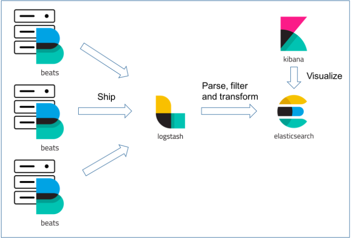
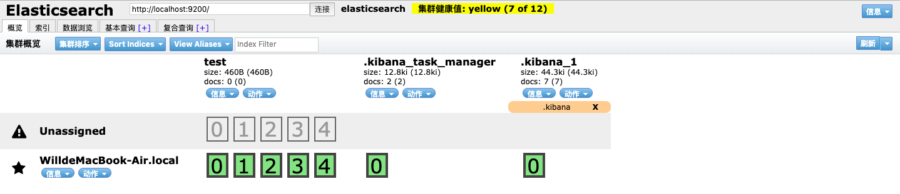
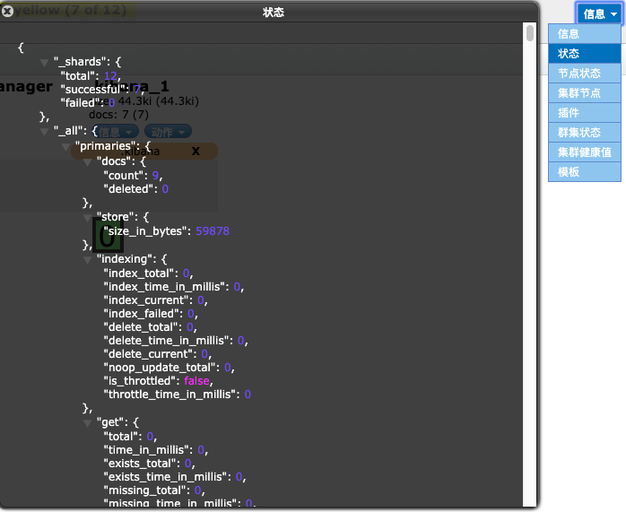
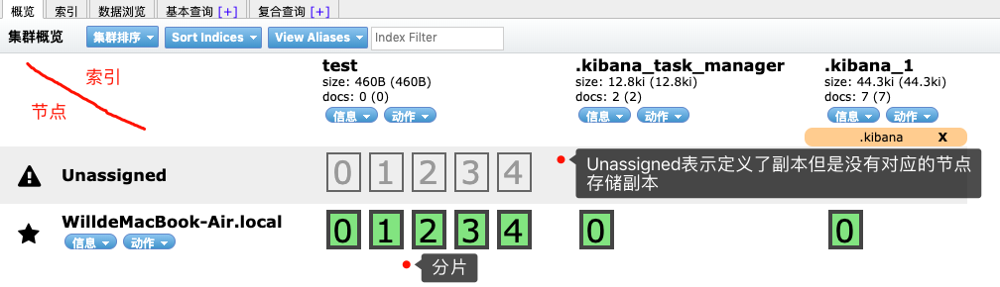
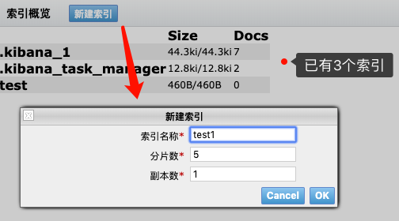
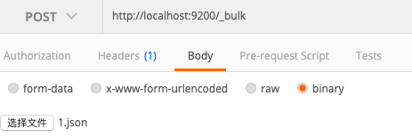

# ElasticSearch

## 简介

+ Lucene、Solr、ElasticSearch关系

  + Lucene

    Apache旗下的1个子项目，但是直接使用比较费劲，所以一般不用这个

  + Solr

    基于Lucene实现的1个封装好的应用，可以直接使用，拥有活跃的社区，但是更适用于静态检索，基于zookeeper实现集群

  + ElasticSearch

    新兴技术，也是基于Lucene，适用于实时检索，自带集群

+ ELKB技术栈

  + E

    ElasticSearch：用户数据存储及搜索

  + L

    Logstash：用于将各种渠道收集的数据格式化后输出到其他数据源（mysql、redis、elasticSearch）

  + K

    kibana：使用可视化界面展示ElasticSearch中的数据

  + B

    Beats：这是1个系列，包含：fileBeat（收集文件式日志）、Packetbeat（网络数据日志）、Winlogbeat等。用于手机日志，但是不能做复杂分析，如果需要做复杂分析，需要经过logstash

     

## 安装

### ElasticSearch

+ 到[官网](https://www.elastic.co/cn/downloads/)下载并解压

+ 配置修改

  + 因为linux系统限制，需要将创建文件数修改为65536，线程数修改为4096

    ```
    vim /etc/security/limits.conf
    
    # 末尾新增
    es soft nofile 65536
    es hard nofile 65536
    es soft nproc 4096
    es hard nproc 4096
    ```

  + 修改系统最大可开辟虚拟内存空间大小

    ```
    vim /etc/sysctl.conf
    
    # 新增
    vm.max_map_count=262144
    
    # 配置生效
    sysctl -p
    ```

+ es不能使用root用户启动，需要创建用户并赋予目录权限

  ```
  usradd es
  passwd es
  chown -R es elasticsearch-7.12.0
  ```

+ es用户运行`bin/elasticsearch`文件，启动服务

  默认启动2个端口：9300（TCP服务）、9200（http服务）

  我们对es的操作都是使用Restful Api的方式进行操作

### ElasticSearch-head

>  elasticSearch的简单的可视化操作工具

+ 安装

  ```shell
  $ git clone git://github.com/mobz/elasticsearch-head.git
  $ cd elasticsearch-head
  $ npm install
  ```

+ 配置elasticSearch服务支持跨域

  在`elasticsearch-7.3.1/config/elasticsearch.yml`文件中加入如下配置

  ```
  # 允许跨域
  http.cors.enabled: true
  http.cors.allow-origin: "*"
  ```

+ 启动

  ```shell
  $ cd elasticsearch-head
  $ npm run start
  ```

### Kibana

+ 解压
+ 运行`bin/kibana`，启动服务
+ 默认连接`9200`端口，可已通过`5601`端口访问kibana

## 概念

> 参见：[ElasticSearch教程——基本概念及核心配置文件详解](https://blog.csdn.net/gwd1154978352/article/details/82752702) 

+ 索引（index）

  + 相当于`database`，也叫索引库

  + 索引名称不能包含大写字母，不能以下划线开头，不能包含逗号

+ 类型（type）

  相当于`table`，但是在es中同一索引中不同类型，要尽量保证字段一致（表结构一致）

  在`es7.x`版本中，1个索引只能创建1种类型（默认`_doc`）了

  在`es8.x`版本中，将彻底移除`类型`的概念

+ 文档（document）

  相当于记录

+ 字段（field）

  相当于字段

+ 映射（mapping）

  索引库结构定义，在mapping中可以定义该索引库有多少个表，表中有哪些字段，字段的类型

+ 分片（shard）

  + 1个索引库可以使用多块存储区域来存储这1个索引库，每个区域就是1个分片

    （可以理解为使用5棵树形结构存储1个索引库中的数据，这样可以加快索引效率）

  + 分片又分为主分片和副本分片，1个索引的主分片数量是不可改变的，但是副本分片数量是可以改变的

+ 副本

  就是从节点，用于备份主节点，用于高可用

## head使用

### 页面介绍

 

+ 状态栏

   

  1. es服务地址

     在这里输入es服务地址，点击连接后，head监控的就是该es服务

  2. 健康状态

     黄色没事，红色就有问题了

  3. 运行信息

     在这里可以查询到节点的一些运行状态信息

      

+ 概览

   

  + 每列是1个索引，每行是1个节点，绿色方框代表分片

+ 索引

   

+ 数据浏览

+ 基本查询

+ 复合查询

## 索引操作

### 字段属性

+ type

  用于指定[字段类型](#字段类型) 

+ boost

+ doc_value

+ eager_global_ordinals

+ fileds

  多用途字段用于定义其他类型的属性，参见[多用途字段](#多用途字段) 

+ ignore_above

  不要映射大于此长度的字符串，默认`2147483647`

+ index

  定义该字段是否可以被搜索，默认true

+ index_options

+ norms

  计算评分时是否考虑字段长度，默认false

+ null_value

  用哪个字符串表示该字符串缺失，默认null

+ store

  是否单独存储该字段，默认false

  参见[elasticsearch的store属性跟_source字段](https://blog.csdn.net/jingkyks/article/details/41785887) 

+ simlarity

  指定评分算法，默认BM25

+ normalizer

+ split_queries_on_whitespace

+ analyzer

  指定分析器，默认标准分析器

### 字段类型

> 默认情况下，任何类型的字段都可以是数组或对象

#### 核心

##### keyword

+ 用于精准匹配的字段

+ 在索引之前，分析器`不会`对该字段进行分词

+ 常用于过滤、排序、聚合

+ 示例

  ```http
  PUT my_index
  {
    "mappings": {
      "properties": {
        "tags": {
          "type":  "keyword"
        }
      }
    }
  }
  ```

##### text

###### 单用途字段

+ 用于在全文中索引某值的字段
+ 在索引之前，分析器`会`对该字段进行分词
+ 文本字段不用于排序，很少用于聚合

+ 示例

  ```http
  PUT my_index
  {
    "mappings": {
      "properties": {
        "full_name": {
          "type":  "text"
        }
      }
    }
  }
  ```

###### 多用途字段

+ 有时候，我们希望某个字段既可以用于全文检索，又可以用于精准匹配，此时我们可以为给字段设置1个属性（一般为`keyword`），将该属性设置为`keyword`类型，则该属性则可以用于精准匹配，该字段可以用于全文检索

+ 自动映射时，如果字段自动映射为`text`类型，同时会自动创建`keyword`属性

+ 例

  ```http
  PUT my_index
  {
    "mappings": {
      "properties": {
        "city": {
          "type": "text",
          "fields": {
            "keyword": { 
              "type":  "keyword"
            }
          }
        }
      }
    }
  }
  ```

##### number

+ 包括如下类型

  `long`, `integer`, `short`, `byte`, `double`, `float`, `half_float`, `scaled_float`

##### date

##### date_nanos

##### boolean

##### binary

##### range

+ 包括如下类型

  `integer_range`, `float_range`, `long_range`, `double_range`, `date_range`

##### object

+ json对象类型

##### nested

+ json对象数组类型

##### 其他


### 请求

#### 创建索引

- 请求方式：PUT

- 路径：/索引

- 请求体：

  ```json
  {
  	"mappings":{
  		"properties":{
  			"{字段名}":{
  				"type":"long",
  				"index":true,
  				"store":true
  			}
  		}
  	}
  }
  ```

#### 更新mapping

+ 请求方式：PUT

+ 路径：

  + /{index}/_mapping：更新指定索引
  + /_mapping：更新所有索引

+ 说明

  已有字段会更新，没有字段会新增

+ 例

  ```http
  PUT /twitter/_mapping
  {
    "properties": {
      "email": {
        "type": "keyword"
      }
    }
  }
  ```

#### 删除索引

+ 请求方式:DELETE
+ 路径：/{index}

### 索引模板

+ 自动创建索引时，根据索引名称匹配模板，根据模板创建索引

+ 例

  ```shell
  $ curl -X PUT \
    http://localhost:9200/_template/search_job \
    -H 'content-type: application/json' \
    -d '{
  	"index_patterns": ["search_job"],
      "settings": {
          "number_of_shards": "5", 
          "number_of_replicas": "1",
          "analysis": {
  			"analyzer": {
  				"optimizeIK": {
  					"type": "custom",
  					"tokenizer": "ik_max_word",
  					"filter": [
  						"stemmer"
  					]
  				}
  			}
  		}
      }, 
      "mappings": {
          "properties": {
              "parent_location_name_ch": {
                  "type": "text",
                  "analyzer":"optimizeIK"
              }, 
              "industry_id": {
                  "type": "long"
              }
  }'
  ```

  

## 文档操作

### 新增或全量更新文档

- 请求

  - 格式

    - 请求方式：PUT
    - 路径：/{索引}/_doc/{ID}
    - 请求正文：json数据，最外层每个key对应1文档中1个field

  - 说明

    - 索引：索引库名，没有则自动创建
    - ID：文档的id
    - _doc：类型，由于es7中移除了`type`的概念，所以这里直接使用默认值

  - 例：

    向`customer`索引库中新增1条id为`1`的文档

    ```http
    PUT /customer/_doc/1 HTTP/1.1
    Host: localhost:9200
    Content-Type: application/json
    
    {
    	"name":"shuyan"
    }
    ```

- 响应

  - 例

    ```json
    {
        "_index": "customer",
        "_type": "_doc",
        "_id": "1",
        "_version": 2,
        "result": "updated",
        "_shards": {
            "total": 2,
            "successful": 1,
            "failed": 0
        },
        "_seq_no": 1,
        "_primary_term": 1
    }
    ```

  - 参数说明

    - _index：索引名称
    - _type：类型（已废弃）
    - _id：文档id
    - _version：当前值为该文档的第几个版本，每更新一次，该值加1
    - result：本次操作类型（created、updated等）
    - shards：分片
      - total：一共应该更新到几个分片中（主从节点数）
      - succesful：成功更新到几个分片中
      - failed：几个分片更新失败
    - _seq_no：对分片的第几次操作得到当前值，每对该分片内数据进行1次index、create、update、delete操作，该值都会自增1
    - _primary_term：Primary Shard发生重新分配时，该值自增1

### 根据id获取文档

- 请求

  - 格式

    - 请求方式：GET
    - 路径：/{索引}/_doc/{ID}

  - 说明

    - 索引：索引库名，没有则自动创建
    - ID：文档的id
    - _doc：类型，由于es7中移除了`type`的概念，所以这里直接使用默认值

  - 例：

    获取`test2`索引中id为`2`的文档

    ```http
    GET /test2/_doc/2 HTTP/1.1
    Host: localhost:9200
    ```

- 响应

  - 例

    ```json
    {
        "_index": "test2",
        "_type": "_doc",
        "_id": "2",
        "_version": 2,
        "_seq_no": 4,
        "_primary_term": 1,
        "found": true,
        "_source": {
            "name": "shuyan"
        }
    }
    ```

  - 参数说明

    - found：是否找到指定的文档
    - _source：数据内容

### 删除文档

+ 请求方式：DELETE
+ 路径：/{索引}/_doc/{ID}

### 部分更新文档

+ 请求方式：POST

+ 路径：/{index}/_update/{id}

+ 请求体：在`doc`对象中填入要更新的字段

+ 示例

  ```shell
  $ curl -XPOST "http://localhost:9200/test2/_update/1" \
  		-H 'Content-Type: application/json' \
  		-d'{  "doc": {    "name": "hello world"  }}'
  ```

  

## 搜索操作

> es提供了2种方式对数据进行搜索
>
> + 基于uri搜索，参见[URI search](https://www.elastic.co/guide/en/elasticsearch/reference/7.3/search-uri-request.html#search-uri-request)，不常用
> + 基于body搜索，我们主要研究这个

+ 请求方式：GET、POST

+ 端点：搜索的端点为`/_search`或`/{index}/_search`

+ `Content-type`：`application/json`

+ 请求示例

  ```shell
curl -X GET "localhost:9200/bank/_search?pretty" -H 'Content-Type: application/json' -d'
  {
    "query": { "match_all": {} },
    "sort": [
      { "account_number": "asc" }
    ]
  }
  '
  ```
  
+ 响应示例

  ```json
  {
      "took": 152,																							// 本操作耗时多少毫秒
      "timed_out": false,																				// 是否超时
      "_shards": {																							// 分片信息
          "total": 1,
          "successful": 1,
          "skipped": 0,
          "failed": 0
      },
      "hits": {																									// 结果数据
          "total": {																						// 结果总数信息，该对象表示总数 等于 1000
              "value": 1000,																		
              "relation": "eq"																	
          },
          "max_score": null,
          "hits": [																							// 结果数据，默认取前十
              {
                  "_index": "bank",
                  "_type": "_doc",
                  "_id": "0",
                  "_score": null,
                  "_source": {
                      "account_number": 0,
                      "balance": 16623,
                      "firstname": "Bradshaw",
                      "lastname": "Mckenzie",
                      "age": 29,
                      "gender": "F",
                      "address": "244 Columbus Place",
                      "employer": "Euron",
                      "email": "bradshawmckenzie@euron.com",
                      "city": "Hobucken",
                      "state": "CO"
                  },
                  "sort": [																		// 在结果集中的排序
                      0
                  ]
              },
              。。。。。。
              {
                  "_index": "bank",
                  "_type": "_doc",
                  "_id": "9",
                  "_score": null,
                  "_source": {
                      "account_number": 9,
                      "balance": 24776,
                      "firstname": "Opal",
                      "lastname": "Meadows",
                      "age": 39,
                      "gender": "M",
                      "address": "963 Neptune Avenue",
                      "employer": "Cedward",
                      "email": "opalmeadows@cedward.com",
                      "city": "Olney",
                      "state": "OH"
                  },
                  "sort": [
                      9
                  ]
              }
          ]
      }
  }
  ```

### Query String

- 这种搜索方式是使用字符串表达式进行搜索，生产环境中很少使用

### DSL query

#### 介绍

+ DSL表达式是使用在`query`对象内的

  ```
  GET /_search
  {
      "query": {
          // DSL ...
      }
  }
  ```

+ DSL是用于ES查询的json格式语法，包含2种子句：

  + 简单子句

    match、term、range

  + 复杂子句

    以逻辑方式对子句组装起来进行查询

#### term

+ 说明
  + 使用`term`进行查询时，不会将输入的值先进行分词，直接使用该字符串，与索引中文档的分词进行比对，匹配到一模一样的分词则匹配成功
  + 可以理解为一对一匹配

#### match_all

+ 作用

  查找所有记录

+ 说明

  value中不需要指定其他内容

+ 例

  ```shell
  GET /_search
  {
      "query": {
          "match_all" : {}
      }
  }
  ```

#### match

+ 作用

  用于使用文本、数字、日期、布尔值匹配文本字段

+ 说明

  + 使用`match`进行查询时，会将输入的值先进行分词，再使用分词后的数组，与索引中各个文档的分词数组进行比对，任意分词数组内的元素匹配成功，则认为匹配上了，匹配上的分词数组元素越多，顺序越一致，则分数越高
  + 可以理解为多对多匹配
  + 检索的内容包含分词后数组内的内容，但是顺序不同的也会被检索到，但是会比匹配到更少字段但是顺序相同的分数更低

+ 示例

  ```json
  GET /_search
  {
      "query": {
          "match" : {
              "message" : {
                  "query" : "this is a test"
              }
          }
      }
  }
  ```

+ 模板说明

  + `match`对象中每个key表示的是要匹配哪些字段，上例中要匹配`message`字段
  + 要匹配字段的value值就是定义如何匹配
    + query：
      + 必选
      + 要匹配哪个值，可以是文本、数字、日期、布尔值
    + analyzer：
      + 可选、string、默认使用索引的默认分析器
      + 指定分析器

#### match_phrase

+ 说明
  + 直接使用输入值，与索引中各个文档的分词数组进行比对，文档的分词数组中，任意个连续的分词组合起来等于输入值，则认为匹配上了
  + 可以理解为一对多匹配

#### bool

+ 当1个查询条件涉及到逻辑关系时，需要在`query`中使用复杂查询，`bool`相当于逻辑运算中的`()`，用来圈定谁跟谁是一个层级的

+ `bool`中可以接受：must、should、must_not、filter，但是不能接受match等查询子句

+ `bool`中各个部分之间使用`与`进行连接

+ 例

  ```json
  {
    "query": {
      "bool": {
        "must": [
          { "match": { "age": "40" } }
        ],
        "must_not": [
          { "match": { "state": "ID" } }
        ]
      }
    }
  }
  ```

#### must

+ `must`对象是1个对象或数组，数组内各个元素之间是`与`关系
+ 只接受`bool`或`match`等

#### should

+ `should`对象是1个对象或数组，数组内各个元素之间是`或`关系

+ 只接受`bool`或`match`等

+ `minimum_should_match`

  + 作用：用来设置本次查询的最小匹配度

  + 用法：必须放在`should`后面

    ```json
    {
    	"query":{
    		"bool":{
    			"should":[
    				{
    				"match":{
    					"name":"我"
    				}
    				}
    			],
    			"minimum_should_match":4
    		}
    	}
    }
    ```

  + 可选值：分为2种

    + 整形

      + 正值：表示最少满足几个`should`条件
      + 负值：表示最多不满足几个`should`条件

    + 百分比

      + 正值：最少满足百分之多少`should`条件，向下取整

        如：共5个，该值取75%，则5*75%=3.75，向下取整为3

        则最少满足3个

      + 负值：最多不满足百分之多少`should`条件，向下取整

        如：共5个，该值取-25%，则5*25%=1.25，向下取整为1

        则最多不满足1个，也就是最少满足4个

#### must_not

+ `must_not`对象是1个对象或数组，数组内每个元素结果必须都为false
+ 只接受`bool`或`match`等

#### filter

+ `filter`与`must`是相同的，区别在于`must`条件会用来计算分数，而`filter`不会
+ 只接受`bool`或`match`等

### 排序

### 分页

#### from、size

#### deep page问题

> 参见：[ElasticSearch教程——Search相关、deep paging问题及解决方案](https://blog.csdn.net/gwd1154978352/article/details/82943037) 

#### scroll分页


## 批量操作

### 批量修改

#### 请求

+ 以上传`json文件`的形式执行批量操作

+ `Content-type`请求头必须为`application/x-ndjson`

+ 请求地址为`/_bulk`

+ postman请求示例

   

#### json文件

##### 格式

+ json文件中每行结尾处必须以`\n`结尾，包括最后一行

+ json文件由多组操作组成，每组格式如下：

  ```
  { "{ACTION}" : { "_index" : "test", "_id" : "1" } }
  {SOURCE}
  ```

+ 参数说明

  + _index：指定索引

  + _id：指定文档id

  + ACTION：指定行为，可选值为：

    + index：新增或更新文档
    + create：新增文档，如果已存在则失败
    + delete：删除文档
    + update：更新文档

  + SOURCE：指定新的数据，比如：当`ACTION`为create时，`SOURCE`指定的就是新文档的内容

    当`ACTION`为index、create时，`SOURCE`需要为完整的新数据

    当`ACTION`为delete时，没有`SOURCE`这行

    当`ACTION`为update时，`SOURCE`中仅指定需要更新的字段即可

##### 说明

+ 文件中每组操作之间是相互独立的，一组操作失败并不会影响其他组操作的执行

##### 示例

```json
{"index":{"_id":"1"}}
{"account_number":1,"balance":39225,"firstname":"Amber","lastname":"Duke","age":32,"gender":"M","address":"880 Holmes Lane","employer":"Pyrami","email":"amberduke@pyrami.com","city":"Brogan","state":"IL"}
{"index":{"_id":"6"}}
{"account_number":6,"balance":5686,"firstname":"Hattie","lastname":"Bond","age":36,"gender":"M","address":"671 Bristol Street","employer":"Netagy","email":"hattiebond@netagy.com","city":"Dante","state":"TN"}
```

#### url中指定索引

+ url为`/_bulk`时，需要在文件中指定索引

  ```json
  { "index" : { "_index" : "test", "_id" : "1" } }
  { "field1" : "value1" }
  ```

+ 索引也可以直接提取到url中，文件中未指定索引的操作会使用该索引

  + url：`/{index}/_bulk`

  + 文件

    ```json
    { "index" : { "_id" : "1" } }
    { "field1" : "value1" }
    ```

#### 响应

```json
{
    "took": 32,														// 执行该操作花费了多少毫秒
    "errors": false,											// 是否有出错的
    "items": [														// 每组操作执行结果
        {
            "index": {
                "_index": "test",
                "_type": "_doc",
                "_id": "1",
                "_version": 16,
                "result": "updated",
                "_shards": {
                    "total": 2,
                    "successful": 1,
                    "failed": 0
                },
                "_seq_no": 16,
                "_primary_term": 1,
                "status": 200
            }
        }
    ]
}
```

### 批量查询

+ 请求方式：GET、POST

+ 路径：/{index}/{type}/_mget

  `index`和`type`为可选

+ 请求体

  ```shell
  {
     "docs" : [
        {
           "_index" : "ecommerce",
           "_type" :  "product",
           "_id" :    1
        },
        {
           "_index" : "ecommerce",
           "_type" :  "product",
           "_id" :    2
        }
     ]
  }
  ```

  `_index`和`_type`为可选

+ 说明

  + 当同时在url和正文中指定了索引或类型时，以正文为准

  + 当正文中仅需要指定`id`时，正文也可以改为

    ```json
    {
      "ids":[1,2]
    }
    ```

## 聚合

> 参见：https://blog.csdn.net/gwd1154978352/article/details/84232960

### 基础

+ 概念
  + bucket：1个分组就是1个bucket
  + metric：对分组进行的操作，如：取最大值、最小值
+ 

## 乐观并发控制

> 参见
>
> + [optimistic concurrency control](https://www.elastic.co/guide/en/elasticsearch/reference/7.3/optimistic-concurrency-control.html#optimistic-concurrency-control) 
> + [ElasticSearch教程——并发问题与锁机制](https://blog.csdn.net/gwd1154978352/article/details/82852801) 

## 控制参数

### pretty

+ 用于美化响应的json数据

+ 例

  + 不使用时

    + 请求

      ```http
      curl -X GET   http://localhost:9200/test/_doc/1
      ```

    + 响应

      ```json
      {"_index":"test","_type":"_doc","_id":"1","_version":16,"_seq_no":16,"_primary_term":1,"found":true,"_source":{ "field1" : "value1" }}
      ```

  + 使用时

    + 请求

      ```http
      curl -X GET   http://localhost:9200/test/_doc/1?pretty
      ```

    + 响应

      ```json
      {
        "_index" : "test",
        "_type" : "_doc",
        "_id" : "1",
        "_version" : 16,
        "_seq_no" : 16,
        "_primary_term" : 1,
        "found" : true,
        "_source" : {
          "field1" : "value1"
        }
      }
      ```

### if_seq_no、if_primary_term

> 用于[乐观并发控制](#乐观并发控制) 

### refresh

+ 用于控制本次更改什么时候可以被检索

+ 可选值

  + 立即刷新

    ```
    /bulk?refresh
    /bulk?refresh=true
    ```

    这可能会导致性能下降

  + 等待刷新后再返回响应

    ```
    /bulk?refresh=wait_for
    ```

  + 响应后的某个时刻会自然刷新

    ```
    /bulk
    /bulk?refresh=false
    ```

## 分析器

### API

#### 使用指定分词器对语句分词

+ 请求方式：GET、POST

+ 路径：`{index}/_analyze`或`/_analyze`

+ 示例

  ```shell
  curl -X POST http://localhost:9200/_analyze \
    -H 'content-type: application/json' -d '
  {  
   "analyzer": "ik_smart",
   "text": "中华人民共和国万岁万岁万万岁"			
  }'
  ```

  

### 分类

#### 标准分析器

+ 适合对英文进行查询，会将一个英文单词作为1个分词，分析中文时，会将1个汉字作为1个分词

#### IK分词器插件

> 用于中文分词

##### 安装

+ 安装插件

  ```shell
  $ elasticsearch-plugin install https://github.com/medcl/elasticsearch-analysis-ik/releases/download/v7.3.1/elasticsearch-analysis-ik-7.3.1.zip
  ```

+ 重启elasticsearch

##### 分类

IK带有2种分词器

+ ik_max_word：最细粒度分词，被分词过得语句还会被重复分词
+ ik_smart：最粗粒度分词，被分词过得语句不会被重复分词

##### 高级

+ 高亮、热更新

  参见：https://blog.csdn.net/gwd1154978352/article/details/82728902

##### 优化ik分词器支持英文

> 参见：[ElasticSearch:为中文分词器增加对英文的支持（让中文分词器可以处理中英文混合文档）](https://blog.csdn.net/hereiskxm/article/details/47441911) 
>
> 文中`"tokenizer": "ik"`，`ik`需要修改为`ik_max_word`或`ik_smart`

## 配置

### 介绍

+ config/`elasticsearch.yml`
  + 主配置文件
  + 参见：[ElasticSearch教程——基本概念及核心配置文件详解](https://blog.csdn.net/gwd1154978352/article/details/82752702) 
+ config/`jvm.options`
  + JVM参数配置文件

### elasticsearch.yml

#### 配置参数说明

+ cluster.name

  集群名称，es根据集群名称建立集群，集群名称相同的检测到之后就会在1个集群里

  默认：elasticsearch

+ node.name

  当前节点名称

  最好配置上，其他配置会使用该名称来区分不同节点

+ node.master

  是否可以成为主节点，默认true

  如果想让该节点成为主节点，则为true，如果想仅作为丛节点，则为false

+ network.bind_host:

  + 作用于http端口，提供给外部访问的地址或者host，可以设置多个，如内网ip和外网ip；该设置项有点类似于nginx中的`server_name`，接收到的请求如果不是通过该列表中指定的ip进行访问的，则无法访问

  + 接受 IP 地址，主机名和特定值
  + 默认使用`network.host`

  + 如：es服务的内网ip为`192.168.123.202`，本机ip为`127.0.0.1`，如果当前配置项指定为`192.168.123.202`，则通过`127.0.0.1`访问时，即使能接收到请求，也不会响应

+ network.publish_host

  + 作用于tcp端口，提供集群同步、推送消息的地址，作用与`bind_host`相同
  + 只能设置1个
  + 接受 IP 地址，主机名和特定值

  + 默认使用`network.host`

+ network.host

  + 同时设置`bind_host`和`publish_host`

  + 默认：127.0.0.1

  + 也可以配置为 0.0.0.0，表示不限制
  + 接受 IP 地址，主机名和特定值

+ discovery.seed_hosts

  要组成集群的ip列表

+ cluster.initial_master_nodes

  第一次哪些节点可以参与选举主节点

  可以指定ip或节点名称

  > 修改`network.host`后，`discovery.seed_hosts`和`cluster.initial_master_nodes`必须指定1项，否则启动报错

+ 跨域

  ```yml
  http.cors.enabled: true
  http.cors.allow-origin: "*"
  ```

#### 常用配置总结

```yaml
node.name: node-1
network.host: 0.0.0.0
discovery.seed_hosts: ["192.168.123.202","192.168.123.22"]
cluster.initial_master_nodes: ["node-1", "node-2"]
# 允许跨域
http.cors.enabled: true
http.cors.allow-origin: "*"
```

## 集群

### 节点、分片

+ 生产环境中，最好1个机器上部署1个节点
+ 1台机器上存在多个主分片是没有意义的，最好保证每个主分片都位于单独的节点，也就是`分片数小于等于节点数`

### 扩容

+ 性能扩容

  从节点数可以更改，并且es支持读写分离，所以可以增加从节点数

+ 容量扩容

  容量没办法扩容，分配好的主节点数不能更改，只能增加磁盘容量，或定期清理数据

## springboot整合

### 几种方式对比

+ spring-boot-start-data-elasticsearch

  + 优点
    + 集成方便，springboot天然支持，有很多自动配置
  + 缺点
    + 版本落后太多，根本无法使用，除非使用老版本es

+ jest

  由社区维护，版本有一些延迟，并且社区活跃度不高

+ TransportClient

  es官方提供的原生API，将在后面的版本中弃用

+ elasticsearch-rest-high-level-client

  es官方推荐的API，并且跟随es版本一同更新，强烈推荐

### 整合

+ pom.xml

  + 必须在`properties`中通过以下方式指定版本，因为springboot本身有es的依赖，如果不这么指定，会无法改变springboot使用的依赖的版本

    ```xml
    <properties>
      	<elasticsearch.version>7.3.1</elasticsearch.version>
    </properties>
    ```

  + 引入`elasticsearch-rest-high-level-client`依赖

    ```xml
    <dependency>
        <groupId>org.elasticsearch.client</groupId>
        <artifactId>elasticsearch-rest-high-level-client</artifactId>
        <version>${elasticsearch.version}</version>
    </dependency>
    ```

+ 配置类

  ```java
  @Configuration
  public class ElasticSearchConfiguration {
      private static final int ADDRESS_LENGTH = 2;
      private static final String HTTP_SCHEME = "http";
  
      @Resource
      private EsProperties esProperties;
  
      @Bean
      public RestClientBuilder restClientBuilder() {
        	// esProperties.getNodes() 为在 application.properties 中配置的 集群列表，格式为 ip:port
          HttpHost[] hosts = Arrays.stream(esProperties.getNodes())
                  .map(this::makeHttpHost)
                  .filter(Objects::nonNull)
                  .toArray(HttpHost[]::new);
          return RestClient.builder(hosts);
      }
  
      @Bean
      public RestHighLevelClient highLevelClient(RestClientBuilder restClientBuilder) {
          return new RestHighLevelClient(restClientBuilder);
      }
  
  
      private HttpHost makeHttpHost(String s) {
          assert StringUtils.isNotEmpty(s);
          String[] address = s.split(":");
          if (address.length == ADDRESS_LENGTH) {
              String ip = address[0];
              int port = Integer.parseInt(address[1]);
              return new HttpHost(ip, port, HTTP_SCHEME);
          } else {
              return null;
          }
      }
  }
  ```

### API

> 参见：[官方API文档](https://www.elastic.co/guide/en/elasticsearch/client/java-rest/current/java-rest-high.html) 

## todo

+ [新增索引，并定义结构](#新增索引，并定义结构) 

+ 映射

  + 自动映射：

    https://www.elastic.co/guide/en/elasticsearch/reference/current/dynamic-mapping.html

  + 日期类型format：

    https://www.elastic.co/guide/en/elasticsearch/reference/current/mapping-date-format.html
  
  

